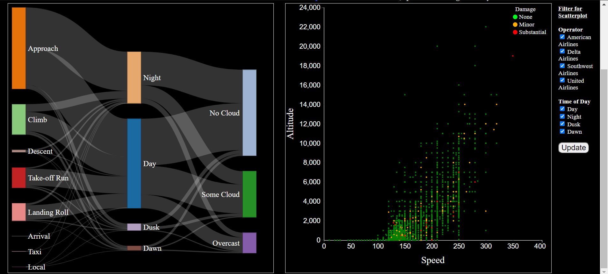

# FAA-wildlife-strike-1990-2019-data-visualization
Subset of FAA Wildlife Strike data from 1990 to 2019 visualized in Sankey Diagram and Scatterplot using d3.js. The purpose of these visualizations are to provide insights into a big number of wildlife strike incidents that happen throughout 1990 to 2019

Data for this visualization was obtained from:
https://github.com/rfordatascience/tidytuesday/tree/master/data/2019/2019-07-23

The data is then further pre-processed and visualized using d3.js.
The content of the site is not optimized for small-sized view(eg. mobile)
Please zoom out until both graphs are visible as shown below.

